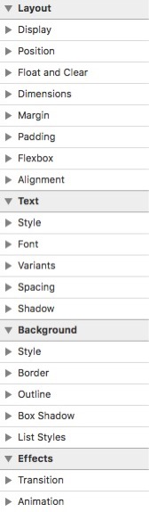

## CSS
> CSS 的神奇之处在于，只要一个月不碰样式，绝对会忘光...

本文档用于记录 CSS 的重点。目录结构如下：

1. [Concept](#concept)
2. [Selector](#selector)
3. [Property](#property)
4. [Snippet](#snippet)

### Concept

关于样式的概念：

- 样式由分号间隔的声明组成，声明 = 属性 (property) + 值
- 作者样式：元素内嵌样式 / 文档内嵌样式 / 外部样式表
- 其他样式：用户样式（自定义），浏览器样式（默认）
- 元素内嵌样式：用 `style` 属性定义
- 文档内嵌样式：在 `<style>` 中定义
- 外部样式：使用 `<link>` 导入，css文件中可用 `@import` 语句

关于相对单位的基准：

- `em`：与元素的 `font-size` 挂钩
- `rem`：与根元素的 `font-size` 挂钩
- `ex`：与元素当前字体中的 x 的高度挂钩，`1ex` 约为 `0.5em`
- `px`：实际的浏览器实现将 `px` 视为绝对单位，`1px` 约为 `1/96in`
- `%`：与某属性值的百分比挂钩，使用 `%` 单位的不同属性与不同的属性值挂钩

关于盒模型（Box Model）：

- 盒是布局方案的实体对象
- 盒模型（Box Model）定义了盒子的尺寸和四个区域的划分
- 盒子的布局上下文是包含块，通常是块级父容器的内容区（content）
- 块级盒（block box）宽度默认充满包含块
- 行内盒（inline box）宽度由实际内容决定，`width` 和 `height` 的设定无效
- border-box 情况下，盒子的 content、padding、border 之和等于其 `width` 或 `height`
- 盒子的 content、padding、border、margin 之和等于其包含块的 content 区域的宽度或高度

关于视觉格式化（Visual Formatting）：

- 基本格式化包括：block 格式化、inline 格式化、inline-block 格式化
- block 格式化：垂直、顺序的布局，纵向的相邻 `margin` 将合并为其中的最大值
- inline 格式化：水平、顺序的布局，纵向的 `margin` 和 `padding` 均无效，inline box 整体构成 line box
- inline-block 格式化：内部采用 block 格式化，外部采用 inline 格式化

关于常规流（Normal Flow）：

- 常规流包含两种：`position` 属性值为 `static` 或 `relative`
- 常规流的特点是不脱离文档流，包含 block/inline 格式化
- `position: static` 盒子的四向位移和 Z 轴层级无效
- `position: relative` 盒子的四向位移和 Z 轴层级均可以使用

关于浮动（Float）：

- 浮动通常用于图文环绕，或者模拟 inline-block 布局
- 浮动由 `float: left/right` 触发，通常需要配合 `width` 设定
- 清除浮动通常采用伪元素解决方案：`clear: both/left/right`
- 浮动效果是脱离文档流，形成新的 BFC，按指定方向浮动到包含块或浮动块的边缘，水平空间不足就下移至可以摆放为止
- 所在 BFC 内，inline box 会环绕 float 块，float 块会覆盖 block box
- `float: left/right` 盒子的四向位移和 Z 轴层级无效

关于绝对定位（Absolute Position）：

- 绝对定位包含两种：`position` 属性值为 `absolute` 或 `fixed`
- 绝对定位的效果是脱离文档流，形成新的 BFC，且盒子的四向位移和 Z 轴层级均可使用
- `position: absolute` 的四向位移相对于最近的 `relative/absolute/fixed` 包含块
- `position: fixed` 的四向位移相对于 viewport
- 绝对定位的 Z 轴层级会形成堆叠上下文（stacking context），盒子的层级堆叠仅发生在相同的堆叠上下文中，且事件无法穿透堆叠上下文

### Selector

#### 层叠与继承

针对某个特定的元素，如果存在样式规则的冲突，需要找到相关的所有属性声明进行优先级判定。

第一步，重要性和来源：

1. reader declaration (important)
2. author declaration (important)
3. author declaration
4. reader declaration
5. user agent declaration

第二步，特殊性和顺序：

1. inline styles
2. IDs
3. classes, pseudo classes, attributes
4. elements, pseudo elements
5. the order of declarations

重要性、来源和特殊性都相同的情况下，才会根据声明的次序判定，后声明的规则优先。

如果某个属性缺少声明，会默认继承父元素样式，但只能继承外观属性，不能继承布局属性。属性值使用 `inherit` 可以强行触发继承。

#### 基本选择器

| 语法 | 解释 |
| - | - |
| * | 任意的元素 |
| E | 指定 E 类型的元素 |
| #&lt;id&gt; | 指定 id 属性的元素 |
| .&lt;class&gt; | 指定 class 属性的元素 |
| [attr] | 具有 attr 属性的元素 |
| [attr="val"] | 具有 attr 属性，且属性值为 val 的元素 |
| [attr^="val"] | 具有 attr 属性，且属性值以 val 子串开头的元素 |
| [attr$="val"] | 具有 attr 属性，且属性值以 val 子串结尾的元素 |
| [attr*="val"] | 具有 attr 属性，且属性值包含 val 子串的元素 |
| [attr&#124;="val"] | 具有 attr 属性，且属性值是 val，或者以 val 子串开头后接连字符的元素 |
| [attr~="val"] | 具有 attr 属性，且属性值是一系列由空格隔开的值，其中一个值为 val 的元素 |

#### 组合选择器

| 语法 | 解释 |
| - | - |
| E F | E 的所有后代 F |
| E > F | E 的直接后代 F |
| E ~ F | E 的所有兄弟 F |
| E + F | E 的相邻兄弟 F |

#### 伪元素选择器

| 语法 | 解释 |
| - | - |
| ::first-line | 目标的首行 |
| ::first-letter | 目标的首字母 |
| ::before | 目标内容前的内容 |
| ::after | 目标内容后的内容 |

#### 伪类选择器

| 语法 | 解释 |
| - | - |
| :link | 未访问的链接 |
| :visited | 已访问的链接 |
| :hover | 鼠标悬停其上 |
| :active | 鼠标已经按下但尚未释放 |
| :focus | 因鼠标或键盘获得了焦点 |
| :enabled | 被启用的表单元素 |
| :disabled | 被禁用的表单元素 |
| :checked | 被选中的表单元素 |
| :indeterminate | 既不是被选中，也不是未被选中的表单元素 |
| :target | 正在被激活的链接所指向的锚 |
| :lang(val) | lang 属性的值为 val，或以 val 开头后接连字符，进行语言匹配 |
| :root | 文档根元素，即 html 元素 |
| :nth-child(val) | 目标是其父元素的某位置的子元素，参数为 even/odd，或者 an+b，其中 n ≥ 0 且 an+b > 0 |
| :nth-last-child(val) | 倒序，参数同上 |
| :first-child | 目标是其父元素的第一个子元素 |
| :last-child | 目标是其父元素的最后一个子元素 |
| :only-child(val) | 目标是其父元素的唯一子元素 |
| :nth-of-type(val) | 目标是其父元素的某类型的子元素，参数为 even/odd，或者 an+b，其中 n ≥ 0 且 an+b > 0 |
| :nth-last-of-type(val) | 倒序，参数同上 |
| :first-of-type(val) | 目标是其父元素的第一个某类型的子元素 |
| :last-of-type(val) | 目标是其父元素的最后一个某类型的子元素 |
| :only-of-type(val) | 目标是其父元素的唯一的某类型的子元素 |
| :not(selector) | 排除某个简单选择器匹配后剩下的元素 |
| :empty |  既没有子元素，也没有文本节点的元素 |

#### 最佳实践

其实还有两个选择器未提及。一个是已被废除的 `:contains()`，一个是很多浏览器已实现的 `::selection`。

编写高效的选择器是有意义的。比如在页面 reflow 的时候会重新应用样式规则，选择器过于低效会让页面更新变慢，最终会被用户感知到这种延迟。来自 David Hyatt 的最佳实践如下：

- 避免使用通配规则。推荐只用 ID、类和标签选择器
- 不要限定 ID 选择器。因为它已经能保证唯一性了
- 不要用具体的标签去限定类选择器。可以尝试扩展一下类名
- 规则越具体越好。把一个合适的类放在特定的元素上比冗长的选择器要好
- 避免使用后代选择器。子选择器会更具体
- 避免使用标签型子选择器。嵌套一些标签不如直接用一个类
- 质疑子选择的使用场景。通常类都可以解决
- 尝试依靠继承。一些子元素可以继承样式的话就能避免重复

### Property

属性通常可以划分为几个类别，Safari 对属性的分类比 Chrome 要好：



属性分组的好处是，可以让声明顺序显得有条理且可追踪：

```css
.declaration-order {
  /* Positioning */
  position: absolute;
  top: 0;
  right: 0;
  bottom: 0;
  left: 0;
  z-index: 99;

  /* Box Model */
  box-sizing: border-box;
  display: block;
  width: 100px;
  height: 50px;
  padding: 10px;
  margin: 20px;
  float: left;
  overflow: hidden;

  /* Typography */
  font-size: 14px;
  font-weight: bold;
  line-height: 1.7;
  text-align: center;
  text-decoration: none;

  /* Visual */
  color: #666;
  border: 1px solid #333;
  border-radius: 3px;
  background-color: #eee;
  box-shadow: 1px 1px 0 4px #ccc;
  visibility: visible;

  /* Misc */
  outline: 0;
  opacity: 0.8;
  cursor: pointer;
  transition: color .7s ease;
}
```

### Snippet

总结一些常用的样式解决方案（hack 技巧记忆起来是负担）。

#### 字体设定

设定原则有几条：

- 英文字体在前。因为中文字体也包含了英文字母
- 中文字体要声明中英两种名称。因为系统语言未必是中文
- 需要针对 mac 和 win 系统分别声明中文和英文

```css
html {
  font-family: Helvetica, Tahoma, PingFang, "苹方", "Microsoft Yahei", "微软雅黑", sans-serif;
}
```

#### 绝对居中

一劳永逸的优雅方式：

```css
.absolute-center {
  position: absolute;
  top: 50%;
  left: 50%;
  transform: translate(-50%, -50%)
}
```

#### 溢出省略

单行文本的溢出省略：

```css
.text-omit {
  width: 50px;
  overflow: hidden;
  text-overflow: ellipsis;
  white-space: nowrap;
}
```

多行文本的溢出省略：

```css
.multi-omit {
  overflow: hidden;
  text-overflow: ellipsis;
  display: -webkit-box;
  -webkit-line-clamp: 2;
  -webkit-box-orient: vertical;
}
```

#### 清除浮动

由于容器发生了高度塌陷，需要额外的元素将浮动元素封闭起来：

```css
.clearfix::after {    
    content: " ";
    display: block;
    clear: both;
    height: 0;
    font-size: 0;
    visibility: hidden;
}
```

### 参考
1. [CSS 参考手册](http://css.doyoe.com/)
2. [HTML5 权威指南 - Adam Freeman](https://book.douban.com/subject/25786074/)
3. [Absolute Centering - CodePen](https://codepen.io/shshaw/full/gEiDt)
4. [CSS Reference - Codrops](https://tympanus.net/codrops/css_reference/)
