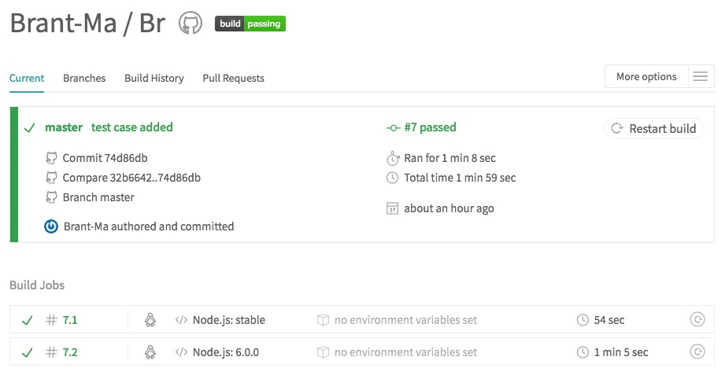

## Continuous Integration
> 自动化构建是条不归路

学习持续集成纯粹出于好奇，想把流程串起来。目前的认识和实践还很基础，日后继续补充。

### 持续集成

持续集成是指：频繁的集成开发成果，尽快的发现代码错误，从而保证开发的速度和质量。

与之相关联的两个词是持续交付和持续部署。三者是递进的流程：

- 持续集成（integrate）是指将新的开发成果不断地整合到主干
- 持续交付（delivery）是指集成的代码可以自动提交给测试团队或者用户
- 持续部署（deploy）是指交付的代码可以自动部署到生产环节

整个持续集成系统由 3 个部分组成：

- 代码仓库：需要进行集成的代码所托管的地方，比如 GitHub 的某个 repo
- CI 服务器：实际的集成过程所发生的地方，比如 Travis 的某个 server
- 完整的构建流程：可以包含很多流程，比如代码审查、代码编译、单元测试

构建流程的重心其实是单元测试。说到测试，大体可以分为三类：

- 单元测试：针对函数或模块的测试
- 集成测试：针对产品的某个功能
- 端对端测试：从用户界面到数据库的全链路测试

持续集成的原理是在 push 或 merge 代码时触发 Git 钩子，完成整个自动化构建的过程。

每次集成时，CI 服务器都会提供一个空白的虚拟机（通常是 Linux 系统），并将用户仓库的最新代码拷贝至虚拟机。然后会读取项目根路径下的 `.travis.yml` 文件，即 CI 配置文件。接着会安装环境和依赖，完成编译和测试的工作。最后生成集成报告，并通知用户（通常是邮件告知）。

### 使用 Travis CI

根据上述流程，可以简单的尝试一次持续集成。

Travis CI 是比较流行的 CI 服务提供者。集成步骤也十分精简：

- 使用 GitHub 登陆并授权 Travis CI
- 添加需要被 travis 管理的项目
- 为该项目添加 `.travis.yml` 文件
- 将代码 push 到远程仓库

可以看出，最主要的工作就是添加配置文件。然而这个文件出乎意料的简单：

```yaml
// .travis.yml
language: node_js
node_js:
  - "5"
  - "6"
install: npm install
script: npm test
```

这是基本的配置写法。如果所有的依赖都列入了 `package.jon` 中，而且测试脚本也是按默认写法加入 `scripts` 字段的，那么最后两行可以省略，因为 Travis 会默认执行 `npm install` 和 `npm test`。

push 之后 就可以等待集成结果了。不出意外的话，几分钟之内就会收到邮件提醒，或者直接在[页面](https://travis-ci.org)里查看。

集成结果有两种：failed 或 passed。如果是前者，那就根据构建日志定位问题并修复；如果是后者，那就可以继续开发新特性了。



当然，构建成功后可以斩获一枚构建状态的徽章，放在 repo 的 `README` 页面里还是很有成就感的。

### 参考

1. [持续集成是什么？ - 阮一峰的网络日志](http://www.ruanyifeng.com/blog/2015/09/continuous-integration.html)
2. [Building a Node.js project - Travis CI](https://docs.travis-ci.com/user/languages/javascript-with-nodejs/)
3. [聊一聊前端自动化测试 - 天镶](https://segmentfault.com/a/1190000004558796)
4. [前端开源项目持续集成三剑客 - cxtom](http://efe.baidu.com/blog/front-end-continuous-integration-tools/)
5. [前端持续集成解决方案 - DiscipleD](https://zhuanlan.zhihu.com/p/23093540)
6. [Shields.io: Quality metadata badges for open source projects](http://shields.io/)
7. [GitHub 项目徽章的添加和设置 - EyreFree](https://lpd-ios.github.io/2017/05/03/GitHub-Badge-Introduction/)
