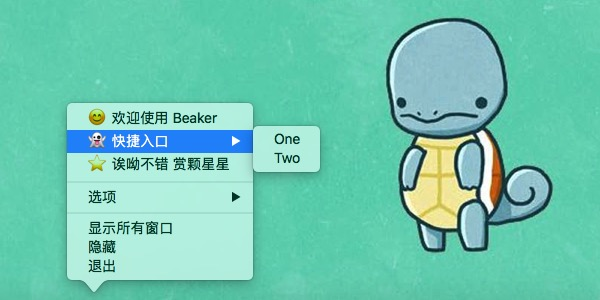

## Electron
> electron 让写 desktop application 变的很有趣

### 1. Electron 是什么

介绍一下 Electron 最基本的概念。

#### 1.1 基本组成

Electron 是一个专注于桌面应用的运行时，它实现了 JavaScript 对桌面应用的占领。在 Electron 中，Node.js 和 Chromium 共享同一个 V8 实例，因此它既是一个可以访问操作系统的 Node.js 变体，又是一个可以呈现 web 页面的小型 Chromium 浏览器。此外，在 Electron 应用的实际代码书写中也既可以使用 Node.js 提供的 Node APIs，也可以使用 Chromium 提供的 Web APIs。

Electron 主要包含了 Main 进程和 Renderer 进程：

- Main 进程负责创建页面。它通过创建 web 页面来呈现 GUI
- Renderer 进程负责呈现页面。它使用 Chromium 及其多进程架构来呈现 web 页面

具体的，Main 进程通过创建 `BrowserWindow` 实例来创建 web 页面，每个实例在它自己的 Renderer 进程中运行一个 web 页面。实例被销毁时，对应的 Renderer 进程也将终止。Main 负责管理所有的 web 页面及其对应的 Renderer 进程，而每个独立的 Renderer 进程只关心运行其中的 web 页面。

#### 1.2 进程通信

为了防止资源泄漏，web 页面不能直接操作本地的 GUI 资源。Renderer 进程需要请求 Main 进程来执行这些操作。具体而言，可以通过 `ipcRenderer` 模块、`ipcMain` 模块和 `remote` 模块来进行 Main 进程和 Renderer 进程之间的通信。

web 页面之间的分享数据有两种方式。一种是使用 HTML5 API，比如 Storage API 和 IndexedDB；另一种是使用 IPC 系统，它能将对象作为全局变量存储在 Main 进程中，然后 Renderer 进程就可以通过 `electron` 模块的 `remote` 属性来访问这些对象：

	// main process
	global.sharedObject = { version: '1.0.0' }

	// in some page
	let version = require('electron').remote.getGlobal('sharedObject').version

### 2. App 全流程

写一个 App 出来总共需要

#### 2.1 书写代码

Electron 应用的基本结构是三个文件：

- `package.json`：配置文件的 `main` 指定了应用的启动脚本，它将启动 main 进程
- `main.js`：负责创建 window，处理系统事件
- `index.html`：作为要呈现的 web 页面

基本的 `package.json` 文件如下：

	{
	  "name": "demo",
	  "version": "1.0.0",
	  "main": "main.js"
	}

基本的 `main.js` 文件如下：

	// import module
	const ele = require('electron')
	const dockInit = require('./script/dock')

	// basic identifier
	let win
	let app = ele.app

	// create window
	let create = () => {
	  win = new ele.BrowserWindow({width: 800, height: 600})

	  win.loadURL(`file://${__dirname}/index.html`)

	  win.on('closed', () => { win = null })
	}

	// event hook for application
	app.on('ready', create)

	app.on('activate', () => {
	  if (win === null) create()
	})

	app.on('window-all-closed', () => {
	  if (process.platform !== 'darwin') app.quit()
	})

基本的 `index.html` 文件如下：

	<!DOCTYPE html>
	<html>
	  <head>
	    <meta charset="UTF-8">
	    <title>demo</title>
	  </head>
	  <body>
	    
	  </body>
	</html>

#### 2.2 运行测试

三个核心文件创建好后，就可以运行 app 来进行本地测试了。这里需要一个包含已经预编译的 Electron 的名叫 `electron` 的 npm 模块。

	// 全局安装 electron
	$ npm install -g electron

	// 本地运行 application
	$ electron .

#### 2.3 打包发布

如果应用运行正常就可以打包发布，然后获得一个可运行的最终形态了。官方提供的方法比较繁琐，最便捷的方法是使用第三方工具，比如 [electron-packager](https://github.com/electron-userland/electron-packager)，之后就可以按照流程进行操作。

首先，确定目录结构没有问题：

	electron-demo
	├── package.json
	├── main.js
	├── [... other files ...]
	└── index.html

然后，确定以下事项没有问题：

- `electron-packager` 已经全局安装
- `package.json` 的 `productName` 或 `name` 已经设置
- `electron` 的某个确切版本已经本地安装，且保存在了 `package.json` 的 `devDependencies`
- `npm install` 已经在本地运行过

最后，在本地目录执行 `$ electron-packager .` 命令。

大功告成！优雅的桌面应用已经默认保存在了本地路径下的 `[app name]-darwin-x64` 路径下。

### 3. App 开发细节

走通全流程并不意味着什么，因为缺少很多开发细节。

#### 3.1 App Icon

没有 Icon 的 App 是不完整的。`nativeImage` 是专门针对图片处理的模块，可以很简单的修改掉 Electron 默认的 Icon：

	const {app, Menu, nativeImage} = require('electron')
	let dock = app.dock

	let initIcon = src => {
	  let image = nativeImage.createFromPath(src)
	  dock.setIcon(image)
	}

关于 dock 的设置除了 icon 还有下一节的 menu，可以定义好后一起调用。

#### 3.2 Dock Menu

Dock 栏的图标右键后是可以有自定义菜单的，本质上就是给 main 进程的 API 传入菜单。先写一个模板：

	const template = {
	  {
	    label: `😊 欢迎使用 ${app.getName()}`,
	    click() { tool.about('me') }
	  },
	  {
	    label: '👻 快捷入口',
	    submenu: [
	      {label: 'One'},
	      {label: 'Two'}
	    ]
	  },
	  {
	    label: '⭐️ 诶呦不错 赏颗星星 ',
	    click() { tool.about('repo') }
	  }
	}

其中的 `tool.about()` 是我封装的链接打开小工具，可以不用理会它。然后将可以跟上一节的 icon 一起使用了：

	let initMenu = () => {
	  let dockMenu = Menu.buildFromTemplate(template)
	  dock.setMenu(dockMenu)
	}

	dockInit.init = src => {
	  initMenu()
	  initIcon(src)
	}

效果如下（搭配壁纸感觉很有趣）：

### 参考
1. [Quick Start | Electron](https://electron.atom.io/docs/tutorial/quick-start/)
2. [Electron FAQ | Electron](https://electron.atom.io/docs/faq/)
3. [Application Distribution | Electron](https://electron.atom.io/docs/tutorial/application-distribution/)
4. [electron-userland/electron-packager | GitHub](https://github.com/electron-userland/electron-packager)
